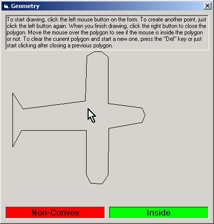



## Verify if a point is inside a polygon \(convex and non\-convex\)

### Description

A project showing how to detect if a point is inside a polygon and check if a polygon is convex or non-convex. Contains a useful class to make the work. Please, vote if you like.
 
### More Info
 

             |
---                |---
**Submitted On**   |2002-03-14 14:59:32
**By**             |[Raul Fragoso](https://github.com/Planet-Source-Code/PSCIndex/blob/master/ByAuthor/raul-fragoso.md)
**Level**          |Intermediate
**User Rating**    |4.9 (39 globes from 8 users)
**Compatibility**  |VB 4\.0 \(32\-bit\), VB 5\.0, VB 6\.0
**Category**       |[Graphics](https://github.com/Planet-Source-Code/PSCIndex/blob/master/ByCategory/graphics__1-46.md)
**World**          |[Visual Basic](https://github.com/Planet-Source-Code/PSCIndex/blob/master/ByWorld/visual-basic.md)
**Archive File**   |[Verify\_if\_621223142002\.zip](https://github.com/Planet-Source-Code/raul-fragoso-verify-if-a-point-is-inside-a-polygon-convex-and-non-convex__1-32682/archive/master.zip)

